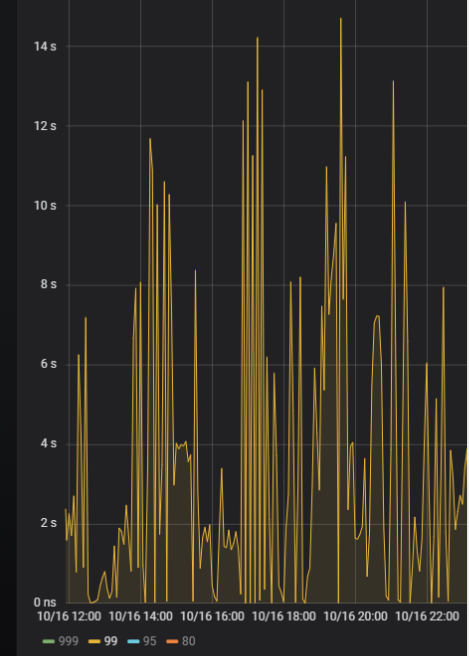
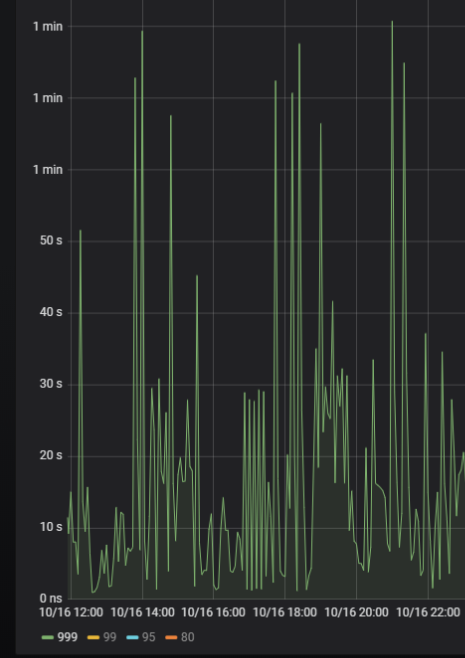
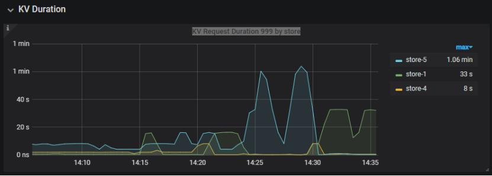
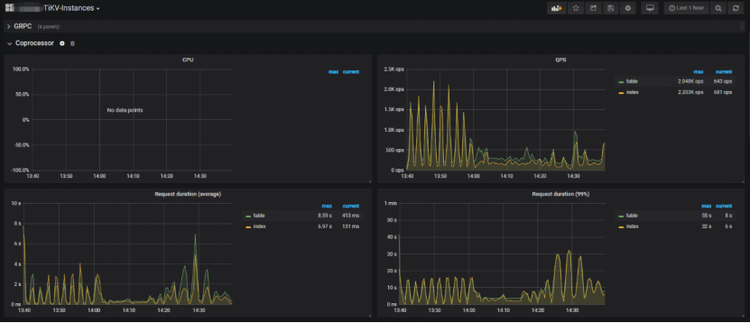
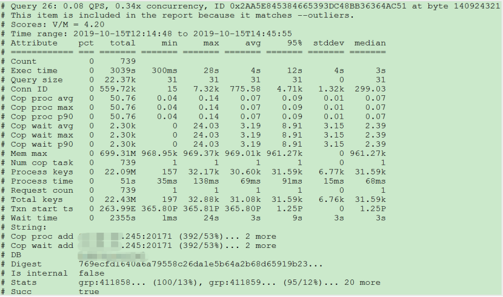
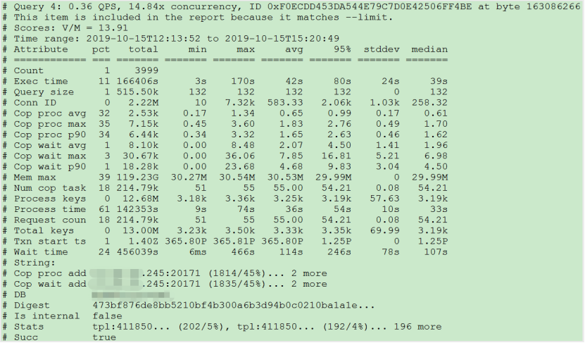
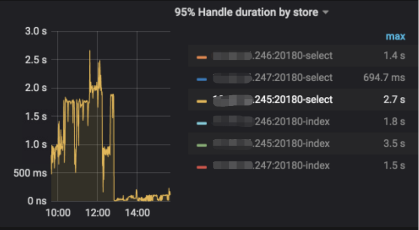

## 案例1 Delete 涉及数据量过大导致 OOM
```
MySQL [db_stat]> explain delete from t_stat where imp_date<='20200202';
+---------------------+--------------+------+------------------------------------------------------+
| id                  | count        | task | operator info                                        |
+---------------------+--------------+------+------------------------------------------------------+
| TableReader_6       | 220895815.00 | root | data:Selection_5                                     |
| └─Selection_5       | 220895815.00 | cop  | le(db_stat.t_stat.imp_date, "20200202")     |
|   └─TableScan_4     | 220895815.00 | cop  | table:t_stat, range:[-inf,+inf], keep order:false |
+---------------------+--------------+------+------------------------------------------------------+
3 rows in set (0.00 sec)
MySQL [db_stat]> select count(*)  from t_stat where imp_date<='20200202';
+-----------+
| count(*)  |
+-----------+
| 184340473 |
+-----------+
1 row in set (17.88 sec)
```
### 背景
* 大批量清理数据时系统资源消耗高，可能导致 TiDB OOM
### 分析
* imp_date 字段虽然有索引，但是范围扫描的数据量过大，无论是走 IndexScan 还是 Table Scan，Coprocessor 都要处理大量数据
### 影响
* TiKV 节点 Coprocessor CPU 飙高
* 执行 Delete 操作的 TiDB 节点内存飙高，因为要将1.8亿条数据加载 tidb server 内存
### 建议
* 删除数据时，缩小数据筛选范围，或者加上 limit N 每次删除一批数据
* 建议使用 3.0 版本的 Range 分区，按照分区快速删除
## 案例2 执行计划不稳定导致查询延迟增加
```
MySQL [db_stat]> explain SELECT * FROM `tbl_article_check_result` `t` WHERE (articleid = '20190925A0PYT800') ORDER BY checkTime desc LIMIT 100 ;
+--------------------------+----------+------+-------------------------------------------------------------------------------------------------------------------------------------------------------------------------------------------------------------------------------------------------------------------------------------------------------------------------------------------------------------------------------+
| id                       | count    | task | operator info                                                                                                                                                                                                                                                                                                                                                                 |
+--------------------------+----------+------+-------------------------------------------------------------------------------------------------------------------------------------------------------------------------------------------------------------------------------------------------------------------------------------------------------------------------------------------------------------------------------+
| Projection_7             | 100.00   | root | db_stat.t.type, db_stat.t.articleid, db_stat.t.docid, db_stat.t.version, db_stat.t.checkid, db_stat.t.checkstatus, db_stat.t.seclevel, db_stat.t.t1checkstatus, db_stat.t.t2checkstatus, db_stat.t.mdaichannel, db_stat.t.mdaisubchannel, db_stat.t.checkuser, db_stat.t.checktime, db_stat.t.addtime, db_stat.t.havegot, db_stat.t.checkcode |
| └─Limit_12               | 100.00   | root | offset:0, count:100                                                                                                                                                                                                                                                                                                                                                           |
|   └─IndexLookUp_34       | 100.00   | root |                                                                                                                                                                                                                                                                                                                                                                               |
|     ├─IndexScan_31       | 30755.49 | cop  | table:t, index:checkTime, range:[NULL,+inf], keep order:true, desc                                                                                                                                                                                                                                                                                                            |
|     └─Selection_33       | 100.00   | cop  | eq(db_dayu_1.t.articleid, "20190925A0PYT800")                                                                                                                                                                                                                                                                                                                                 |
|       └─TableScan_32     | 30755.49 | cop  | table:tbl_article_check_result, keep order:false                                                                                                                                                                                                                                                                                                                              |
+--------------------------+----------+------+-------------------------------------------------------------------------------------------------------------------------------------------------------------------------------------------------------------------------------------------------------------------------------------------------------------------------------------------------------------------------------+
6 rows in set (0.00 sec)
```
### 背景
* articleid 和 checkTime 字段分别建有单列索引，正常情况下走 articleid 索引比较快，有时执行计划不稳定走 checkTime 索引，查询延迟达到分钟级别
### 分析
* LIMIT 100 限定了获取 100 条记录，checkTime 和 articleid 列之间存在相关性，如果列之间的相关度不高，在独立性假设失效时，优化器估算走 checkTime 索引并满足 articleid 条件时扫描的行数，可能比走 articleid 索引扫描的行数更少
### 影响
* 业务响应延迟不稳定，偶尔有抖动
### 建议
* 手动 analyze table，配合 crontab 定期 analyze，维持统计信息准确度
* 自动 auto analyze，调低 analyze ratio 阈值，提高收集频次，并设置运行时间窗口
  * set global tidb_auto_analyze_ratio=0.2;
  * set global tidb_auto_analyze_start_time='00:00 +0800';
  * set global tidb_auto_analyze_end_time='06:00 +0800';
* 业务修改 SQL ，使用 force index 固定使用 articleid 列上的索引
* 3.0 版本下，业务不修改 SQL，使用 create binding 创建 force index 的绑定 SQL
## 案例3 查询字段与值的数据类型不匹配
```
MySQL [db_stat]> explain select * from t_like_list where person_id=1535538061143263;
+---------------------+------------+------+-----------------------------------------------------------------------------------+
| id                  | count      | task | operator info                                                                     |
+---------------------+------------+------+-----------------------------------------------------------------------------------+
| Selection_5         | 1430690.40 | root | eq(cast(db_stat.t_like_list.person_id), 1.535538061143263e+15) |
| └─TableReader_7     | 1788363.00 | root | data:TableScan_6                                                                  |
|   └─TableScan_6     | 1788363.00 | cop  | table:t_like_list, range:[-inf,+inf], keep order:false                       |
+---------------------+------------+------+-----------------------------------------------------------------------------------+
3 rows in set (0.00 sec)


MySQL [db_stat]>
```
### 背景
* person_id 列上建有索引且选择性较好，但执行计划走了 TableScan
### 分析
* person_id 是字符串类型，但是存储的值都是数字，业务认为可以直接赋值；而优化器需要在字段上做 cast 类型转换，导致无法使用索引
### 建议
* where 条件加上引号
```
MySQL [db_stat]> explain select * from table:t_like_list where person_id='1535538061143263';
+-------------------+-------+------+----------------------------------------------------------------------------------------------------------+
| id                | count | task | operator info                                                                                            |
+-------------------+-------+------+----------------------------------------------------------------------------------------------------------+
| IndexLookUp_10    | 0.00  | root |                                                                                                          |
| ├─IndexScan_8     | 0.00  | cop  | table:t_like_list, index:person_id, range:["1535538061143263","1535538061143263"], keep order:false |
| └─TableScan_9     | 0.00  | cop  | table:t_like_list, keep order:false                                                                 |
+-------------------+-------+------+----------------------------------------------------------------------------------------------------------+
3 rows in set (0.00 sec)
```
## 案例4 读热点导致的 SQL 延迟增加
### 背景
一个数据量不大(600G左右)读多写少的集群，某段时间发现 query summary 监控中的 duration 显著增加，p99 如下图：

![])

p999 如下图：



通过查看监控发现 TiDB 的 KV Duration 变高，KV Errors 仍然很低。其中 KV Request Duration 999 by store 监控是各 TiKV 轮流上涨，如下图：



继续查看 TiKV 监控，Coprocessor Overview 如下：




Coprocessor CPU 如下：


Coprocessor 监控如下：


Coprocessor CPU 几乎打满了 CPU。下面开始分析日志，调查 Duration 和 Coprocessor CPU 高的原因。

### 慢查询日志分析
通过 pt-query-digest 工具分析 TiDB 慢查询日志：

```
./pt-query-digest  tidb_slow_query.log  >  result
```
分析 result 发现 Process keys 多的 SQL 并不一定 Process time 也长，二者并不正相关。比如如下 SQL 的 Process keys 为 22.09M，Process time 为 51s：


但是如下 SQL 的 Process keys 为 12.68M，而 Process time 为 142353s：


过滤 Process time 较多的 SQL，发现了3个典型的 SQL，分析执行计划是否正常：

```
SQL1: select a.a_id, a.b_id,uqm.p_id from a join hsq on a.b_id=hsq.id join uqm on a.a_id=uqm.id;  
```
 



```

SQL2: select distinct g.abc, g.def, g.ghi, h.abcd, hi.jq   from ggg g left join ggg_host gh on g.id = gh.ggg_id left join host h on gh.a_id = h.id left join a_jq hi on h.id = hi.hid   where h.abcd is not null and h.abcd  <>  '' and hi.jq is not null and hi.jq  <>  '';

```



```

SQL3: select tb1.mt, tb2.name from tb2 left join tb1 on tb2.mtId=tb1.id where tb2.type=0 and (tb1.mt is not null and tb1.mt != '') and (tb2.name is not null or tb2.name != '');
```


从执行计划看没有问题，查看表的统计信息也正常，继续分析 TiDB、TiKV日志。

### 一般日志分析
查看日志中标记为 [slow-query] 的日志行中的 region 分布情况：

```
more tikv.log.2019-10-16-06\:28\:13 |grep slow-query |awk -F ']' '{print $1}' | awk  '{print $6}' | sort | uniq -c | sort –n
```
访问频率最大的3个 region 为：
```
	 73 29452
    140 33324
	757 66625
```
这些 region 的访问次数远大于其它 region。之后定位这些 region 所属的表名。
首先查看 [slow-query] 行里的 table_id 记录值和 start_ts 记录值,然后查询 TiDB 日志以获取表名。比如 table_id 为1318，start_ts 为411837294180565013，则：

```
more tidb-2019-10-14T16-40-51.728.log |grep '"/[1318/]"' |grep  411837294180565013
```
过滤后发现是上述慢查询 SQL 涉及到的表。
### 操作优化
尝试对这些 region 做 split 操作，以 66625 为例，需要将 x.x.x.x 替换为实际的 pd 地址：

```
pd-ctl –u http://x.x.x.x:2379 operator add split-region 66625
```
查看 PD 日志如下：
```
[2019/10/16 18:22:56.223 +08:00] [INFO] [operator_controller.go:99] ["operator finish"] [region-id=30796] [operator="\"admin-split-region (kind:admin, region:66625(1668,3), createAt:2019-10-16 18:22:55.888064898 +0800 CST m=+110918.823762963, startAt:2019-10-16 18:22:55.888223469 +0800 CST m=+110918.823921524, currentStep:1, steps:[split region with policy SCAN]) finished\""]
```
说明 region 分裂完成，之后查看是否 region 仍然是热点:	
```
more tikv.log.2019-10-16-06\:28\:13 |grep slow-query  | grep 66625 | more
```
观察一段时间后确认 66625 已不是热点 region，之后继续处理其它的热点 region。
所有热点 region 处理完成后 query summary 监控中的 duration 显著降低：


不过只保持了一段时间(19:35 后仍有较高的 duration 出现，下图未列出)：


观察压力较重的 tikv，移走热点 region 的 leader：

```
pd-ctl –u http://x.x.x.x:2379 operator add transfer-leader 1 2 //把Region1 的 leader 调度到 Store2
```
leader 迁走之后 ，原 TiKV 的 duration 立刻下降了，但是 leader 所在的 TiKV duration 随之上升(图中展示了一个 TiKV 的变化过程)：


分析后反复分裂热点 region，之后效果如下：


### 调优总结
对于分布式数据库读热点的情况，难以通过优化 SQL 本身来解决，需要通过系统分析整个数据库的状态来定位原因，采用分裂 region 的方式来缓解和消除读热点对 SQL 查询效率的影响。读热点实际上限制了分布式数据库的并发读取优势，分裂 region 的方式本质上是恢复分布式数据库的并发读取优势。

